Migración de Servidores y datos

Víctor Martínez Martínez Ciclo Administración de Sistemas Informáticos en Red Memoria del proyecto de ASIR

IES La Senia. Curso 2023/24. Grupo 1. 11 de Junio de 2024 Ángel Berlanas Vicente

## Índice

1. [**Introducción 4**](#_page3_x72.00_y72.00)
1. [Explicación del proyecto 4](#_page3_x72.00_y201.90)
1. [¿Qué es Iukanet? 5 ](#_page4_x72.00_y72.00)[La empresa se centra en 3 principales puntos: 6](#_page5_x72.00_y352.94)
1. [Calidad de Servicio 6](#_page5_x72.00_y403.36)
1. [Transparencia 6](#_page5_x72.00_y500.86)
1. [Disponibilidad 6](#_page5_x72.00_y586.37)

[Metodología de trabajo 7](#_page6_x72.00_y72.00)

1. [Monitorización 7](#_page6_x72.00_y99.87)
1. [Soporte al usuario 7](#_page6_x72.00_y440.02)

[Gestión de infraestructura 8 ](#_page7_x72.00_y72.00)[Algunos clientes con los que trabaja 9](#_page8_x72.00_y72.00)

2. [**Justificación 9**](#_page8_x72.00_y318.12)
1. [Reinversión 9](#_page8_x72.00_y408.92)
1. [Obsolescencia 10](#_page9_x72.00_y72.00)
1. [Aumento y requisitos de clientes 10](#_page9_x72.00_y154.70)
1. [Documentación 11](#_page10_x72.00_y72.00)
3. [**Objetivo 11**](#_page10_x72.00_y442.83)
1. [Económico 12](#_page11_x72.00_y72.00)
1. [Ampliación en el sector 12](#_page11_x72.00_y363.68)
1. [Referencia para nuevos clientes 12](#_page11_x72.00_y449.83)
1. [Estabilidad 12](#_page11_x72.00_y535.98)
4. [**Recursos 12**](#_page11_x72.00_y651.23)
1. [Servidores 13](#_page12_x72.00_y72.00)
   1. [Equipos DELL 13](#_page12_x72.00_y96.51)
   1. [Equipos HP 13](#_page12_x72.00_y604.71)
   1. [Equipos Synology 14](#_page13_x72.00_y72.00)
1. [Routers y Firewalls 14](#_page13_x72.00_y222.79)
   1. [Equipo Fortinet 14](#_page13_x72.00_y265.30)
   1. [Equipos MikroTik 14](#_page13_x72.00_y508.15)
1. [Switches y Patch panels 15](#_page14_x72.00_y93.18)
   1. [Equipos Cisco 15](#_page14_x72.00_y129.69)
   1. [Patch Panel 15](#_page14_x72.00_y290.48)
1. [PDU’s 15](#_page14_x72.00_y529.26)

   5. [CPD 16](#_page15_x72.00_y72.00)
1. [Programas y servicios 19](#_page18_x72.00_y72.00)

   [4.6.1. Nagios 19](#_page18_x72.00_y96.51)

   3. [Node-exporter 21](#_page20_x72.00_y72.00)
   3. [Grafana 21](#_page20_x72.00_y409.26)
   3. [Zap-bot 22](#_page21_x72.00_y413.54)
   3. [Netbox 23](#_page22_x72.00_y354.12)
7. [Otros 24](#_page23_x72.00_y72.00)

   [4.7.1. Conectividad 24 ](#_page23_x72.00_y96.51)[Alimentación 24 ](#_page23_x72.00_y156.16)[Internet 24](#_page23_x72.00_y471.93)

5. [**Metodología y Planificación del proyecto 25**](#_page24_x72.00_y430.39)
1. [Planificación de la migración 25](#_page24_x72.00_y580.28)
1. [Documentación de los racks 26](#_page25_x72.00_y72.00)
1. [Acuerdo con los clientes para realizar la migración 26](#_page25_x72.00_y212.88)
1. [Preparación 26](#_page25_x72.00_y386.31)
1. [Migración 26](#_page25_x72.00_y501.56)
1. [Reparación de los daños 27](#_page26_x72.00_y72.00)
1. [Monitorización Evaluación 27](#_page26_x72.00_y169.25)
1. [Finalización de la migración 27](#_page26_x72.00_y284.49)
6. [**Desarrollo del proyecto 27**](#_page26_x72.00_y385.19)
1. [Planificación de la migración 27 ](#_page26_x72.00_y461.44)[Víctor: 27 ](#_page26_x72.00_y562.14)[Sergio: 27 ](#_page26_x72.00_y643.55)[Juan: 28](#_page27_x72.00_y72.00)
1. [Documentación de los racks 28](#_page27_x72.00_y234.03)
1. [Acuerdo con los clientes para realizar la migración 28](#_page27_x72.00_y691.58)
5. [Migración 29](#_page28_x72.00_y294.16)
5. [Reparación de los daños 30](#_page29_x72.00_y380.26)
   1. [Discos dañados 30](#_page29_x72.00_y466.41)
   1. [Problemas de red 30](#_page29_x72.00_y560.46)
   1. [Daños físicos 31](#_page30_x72.00_y72.00)
5. [Monitorización Evaluación 31](#_page30_x72.00_y179.15)
5. [Finalización de la migración 31](#_page30_x72.00_y279.84)
7. [**Evaluación y conclusiones finales 31**](#_page30_x72.00_y438.73)
7. [**Referencias 32**](#_page31_x72.00_y72.00)

1. **Introducción** 

El proyecto de final de grado se centra en la migración de servidores, el cual es un proceso al que va a recurrir la empresa para mejorar y crecer tanto a nivel interno como en el sector del webhosting para poder abarcar un mayor porcentaje dentro del mercado.

Se implementará el uso de nuevos materiales, técnicas, productos y procedimientos que mejoren aspectos como pueden ser la velocidad, la seguridad, la conexión o el almacenamiento entre otros de datos de los clientes.

1. Explicación del proyecto

Se ha elegido realizar el proyecto final junto con la empresa ya que se ha considerado una buena oportunidad elegir un momento de crecimiento de la empresa para ir documentando los pasos que se ha ido realizando.

Se hablará sobre la empresa, a que se dedica, que ofrece, como trabaja para ponerse en situación.

Se explicará el proceso de la migración de todo lo que este proyecto supone a nivel tanto físico como software.

2. ¿Qué es Iukanet? 

Iukanet es una empresa proveedora de servicios especializados en la gestión de activos digitales. La empresa con más de 10 años se ha ido especializando en servicios en la nube así como de gestión de infraestructura como de aplicación (webs comerciales, aplicativos de backend, API, microservicios, etc).

El núcleo del negocio de iukanet está en la monitorización y el soporte en la gestión de la infraestructura. Un equipo de administradores de sistemas se encarga de esta gestión, apoyándose en herramientas open source de gran implantación para cumplir con los objetivos pactados con los clientes. Con más de 10 años de experiencia, iukanet se ha especializado en la gestión de infraestructura tanto en sus centros de datos propios como en clouds públicos como Azure, AWS o Google Cloud.

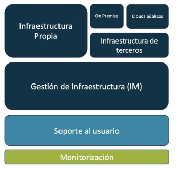

Con más de 10 años de experiencia, iukanet se ha especializado en los servicios cloud, tanto de gestión de infraestructura, como de aplicación (webs comerciales, aplicativos de backend, API, microservicios, etc), así como en ofrecer un excelente soporte al usuario.

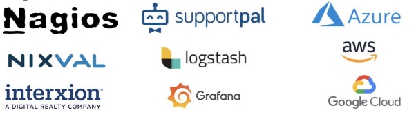

En la base de todos los servicios se encuentra la monitorización constante de los activos digitales gestionados y el soporte al usuario. De esta forma, se garantiza un servicio preventivo y proactivo, así como una rápida respuesta ante incidentes.

**La empresa se centra en 3 principales puntos:**

1. Calidad de Servicio

La atención al usuario se considera una parte fundamental del servicio. En el ADN de iukanet está la búsqueda de la mayor calidad posible en la atención a los usuarios y en la entrega de los servicios.

2. Transparencia

Se procura la mayor transparencia con los usuarios. Para esto, se utiliza la tecnología para maximizar la disponibilidad de la información para todos los stakeholders de los proyectos.

3. Disponibilidad

La disponibilidad del servicio es clave para la satisfacción de los usuarios en entornos cloud. Por ello, se mantienen altos estándares de calidad para garantizar la mayor disponibilidad del servicio posible.

**Metodología de trabajo**

1. Monitorización

Monitorizar la disponibilidad y la calidad de los servicios es esencial para ofrecer un servicio proactivo y de alta calidad. Se establecen KPI con los clientes, los cuales se monitorean para cada activo. Esto permite obtener información fundamental sobre el estado de los servicios y programar las acciones correctivas necesarias en caso de observar desvíos. De esta manera, es posible anticiparse a posibles problemas, asegurando que se mantenga un nivel óptimo de servicio en todo momento.

Con cada comprobación, el sistema de monitorización comprueba si el resultado está dentro de los parámetros configurados para este KPI, en caso de no estarlo, lanza un aviso al centro de soporte, quien notificará a los stakeholders para mantenerlos informados de las acciones correctivas que se han llevado a cabo sobre el activo.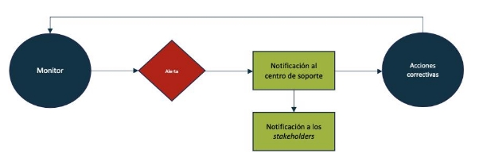

2. Soporte al usuario

El centro de soporte acepta distintas formas de comunicación de las incidencias según su gravedad. En cualquier caso, y para facilitar la trazabilidad de las incidencias, el equipo de soporte siempre abrirá un ticket por cada incidencia, independientemente de la forma de comunicación elegida por el usuario.

El tiempo de respuesta se calculará como la media de los tiempos de respuesta del mes, tomando como válido el momento de la comunicación efectiva de la incidencia.

En la tabla siguiente, se detallan las formas de comunicación disponibles para cada tipo de incidencia, destacando la forma recomendada.

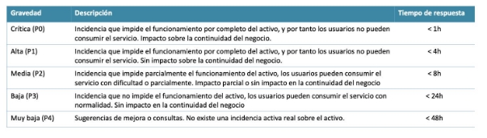

**Gestión de infraestructura** 

El personal de iukanet dedicado a la gestión de infraestructura tiene como objetivo conjugar las necesidades de los usuarios con la tecnología disponible, siguiendo estrictamente los estándares de seguridad en la red. De esta manera, se logra mantener la infraestructura de los clientes segura y funcional.

El servicio de gestión de infraestructura de iukanet abarca desde la gestión técnica de copias de seguridad, stack de virtualización, dispositivos físicos y distintos formatos de virtualización, hasta el despliegue de servicios y la monitorización del sistema. Esta gestión se encuentra en la intersección entre los aspectos más técnicos y el usuario final. Apoyándose en el centro de soporte, iukanet sitúa al usuario en el centro de sus operaciones con el objetivo de maximizar la calidad de su experiencia.

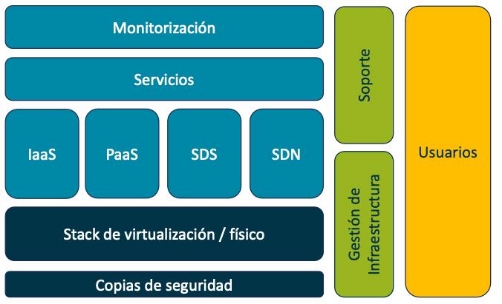

**Algunos clientes con los que trabaja** 

Gracias a los usuarios, ha sido posible crecer y afianzar el conocimiento sobre cómo lograr la mayor calidad en los servicios. Iukanet trabaja en varios sectores, alcanzando casos de éxito en todos ellos.

2. **Justificación**

La justificación de la creación de este proyecto se centra en 3 puntos que se van a desarrollar a continuación:

1. Reinversión

La empresa al estar teniendo un previsto crecimiento está reinvirtiendo parte de su beneficio anual en adquirir nuevos equipos y material para poder estar por encima del crecimiento de clientes nuevos que pueda recibir la empresa y poder de esta manera abarcar el mayor número de clientes posibles.

2. Obsolescencia 

Algunos de los equipos que se encuentran en funcionamiento en la empresa están empezando a ser lo suficientemente potentes y antiguos como para que Iukanet los considere óptimos o fiables para el cliente, arriesgandonos a que puedan sufrir fallos o anomalías que un nuevo equipo sería más improbable que suceda.

3. Aumento y requisitos de clientes

Como se ha mencionado antes, Iukanet, al observar un crecimiento de clientes y así de los requisitos mínimos que piden en sus servicios alojados se necesita esta migración y ampliación de la infraestructura de la empresa.

4. Documentación 

Al migrar a una nueva sala todos los servidores se aprovechan para tener una documentación más limpia y mejor redactada sobre los equipos que hay en activo, así como sus números de serie, discos asignados, a la red en la que se encuentran trabajando, a los clientes a los que sirven…

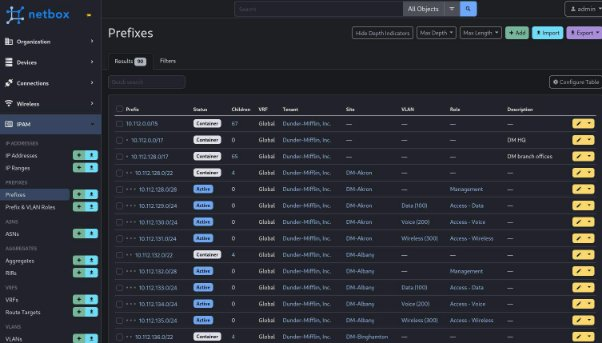

3. **Objetivo**

El objetivo principal es el crecimiento de Iukanet en el sector del mercado en el que se encuentra.

Este objetivo se puede dividir en objetivo económico, sectorial, mayor recepción de clientes y estabilidad dentro de la empresa.

1. Económico 

Uno de los objetivos principales de esta operación es la de aumentar el flujo económico para que la empresa pueda tener cada vez un beneficio mayor, así pudiendo reinvertir en la propia empresa para seguir creciendo.

2. Ampliación en el sector

Una de las ambiciones de una empresa es ocupar el máximo porcentaje posible dentro del mercado en el que se encuentra, y con este proyecto, al invertir en sí misma para un crecimiento de la infraestructura consigue abarcar un mayor flujo de clientes.

3. Referencia para nuevos clientes

Cuanto más crezca la empresa más se dará a conocer dentro del sector, lo que quiere decir que cada vez más clientes sabrán de Iukanet y querrán contratar los servicios que se ofrecen así de esta manera cada vez más clientes.

4. Estabilidad

Otro de los objetivos de este proyecto es el de generar un nivel de estructural en varios sentidos, a nivel de seguridad por los nuevos equipos que se instalarán, junto con los servicios y protecciones que ofrecen, a nivel de disponibilidad puesto que al ampliar la cantidad de equipos y la implementación de equipos nuevos hará una mejoría en la prestación de servicios.

4. **Recursos**

En este apartado se va a hablar sobre todos los recursos que se van a utilizar a lo largo del proyecto así como una pequeña explicación de cada uno de ellos como pueden ser servidores, switches, programas, etc.

1. Servidores 
1. Equipos DELL

Los equipos de esta marca son servidores donde alojan la mayoría de la información de los clientes de la empresa

- DELL R410
- DELL R440 
- DELL R610 
- DELL R620 
- DELL R640 
- DELL R740 
- DELL D740xd

(Ejemplo de un servidor DELL R620 por dentro)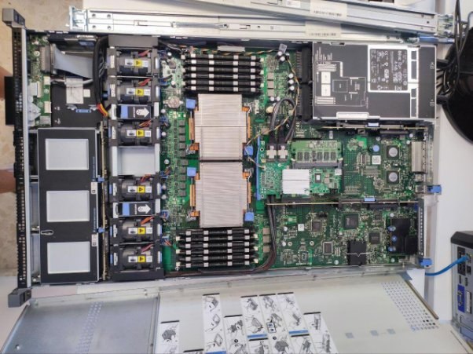

2. Equipos HP

Estos equipos al igual que los Dell almacenan información de los clientes que tienen contratados nuestros servicios de hosting

- HP DL165 G7 
- HP DL165 G9 
- HP DL20 G9 
- HP DL360P G8 
3. Equipos Synology 

Esta marca de servidores son las que usan com NAS ( Network attached storage o Almacenamiento conectado en red ) para almacenar todos los datos de los servidores 

- Synology RS814
- Synology RS816
- Synology RX415
2. Routers y Firewalls
1. Equipo Fortinet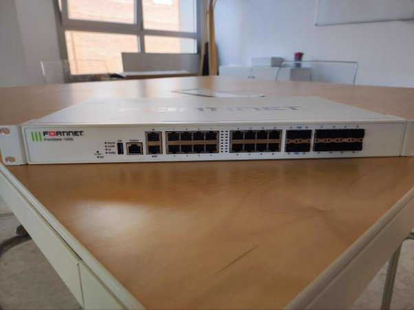

Estos equipos son los encargados de la seguridad en la red, actuando como Firewall, WAF (Web application firewall) o VPN (virtual private network).

- Fortinet Fortigate 100F

(Ejemplo de un equipo Fortinet Fortigate 120G)

2. Equipos MikroTik

Los equipos de esta marca son los encargados de enrutar toda la red hacia el exterior, es decir, routers o puntos de acceso 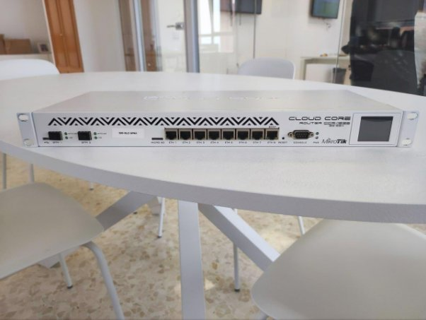

- MikroTik CCR1016-12G 
- MikroTik CCR1036-8G-2S+ 

(Ejemplo de un equipo MikroTik CCR1036-8G-2S+)

3. Switches y Patch panels
1. Equipos Cisco

Los cisco que hay en la red son tod switches, para interconectar entre sí los equipos que están dentro de las redes de la empresa

- CISCO CATALYST 4948 
- CISCO N3K3064PQ10GE 
- CISCO N3K-3064PQ-10GE 
2. Patch Panel

Estos equipos son los encargados de identificar los cables que están conectados a los equipos

- Patch Panel Gigaflex 24 ports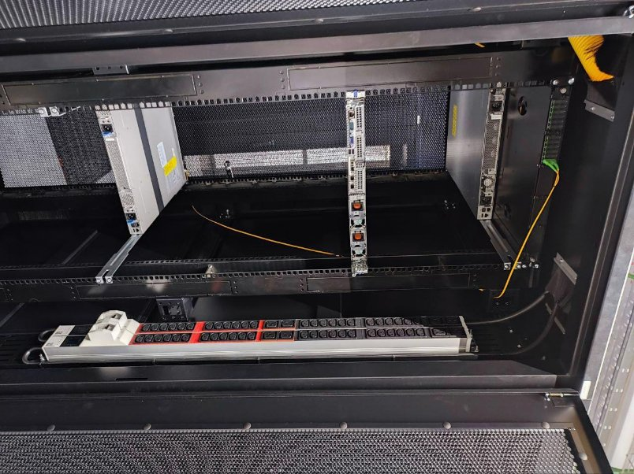
- Patch Panel Keynet 24 ports
- Patch Panel GTLan 24 ports

(Ejemplo de un patch panel de 24 bocas conectado a un switch)

4. PDU’s

Las regletas son las encargadas de dar luz a todos los equipos que haya en el armario.

- Bachman PDU Básica (C13, C19)

(Ejemplo de una pdu de un armario del CPD)

4.5 CPD

El lugar donde se encuentran todos estos equipos y dispositivos es en un CPD (Centro de Procesamiento de Datos), una ubicación física donde se concentran los equipos informáticos y de telecomunicaciones necesarios para procesar, almacenar y transmitir los datos de una organización. CPD normalmente cuenta con medidas de seguridad y redundancia para garantizar la disponibilidad e integridad de la información.

Aquí se puede observar la nueva sala que se ha habilitado para almacenar más equipos junto al armario donde se migrarán todas las máquinas:

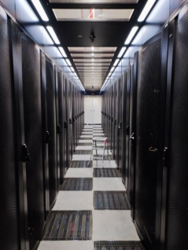 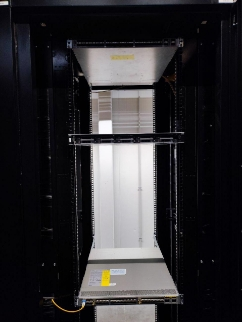

Se observa que se han colocado varios switches y un servidor para hacer pruebas.

A continuación se muestra una imagen de cómo están organizados en el antiguo rack o armario, tanto por delante como por detrás:

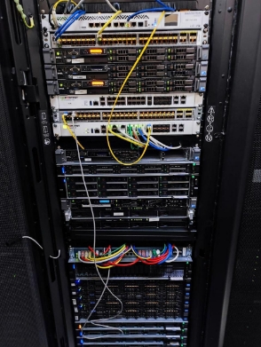 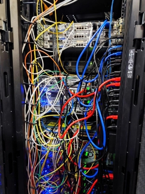

Como se puede observar hay una gran cantidad de cables ethernet y de alimentación que necesitan una organización, una vez se haya realizado la migración de todos los equipos se organizará para que no haya un desorden y toda acción, cable o servidor este documentado.

En la oficina también se dispone de un pequeño armario donde se puede observar un switch, un patch panel, un router y varios fortinet en HA (High adaptability) para servir de internet a todos los equipos de la oficina:

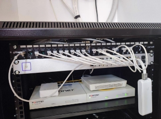

Claramente para poder alimentar decenas de estos armarios hace falta una gran fuente de energía, desgraciadamente por politicas de empresa del CPD, únicamente el personal autorizado puede entrar en la sala de generadores, no obstante, se puede observar el cuadro de luces de la sala donde se encuentra el antiguo armario.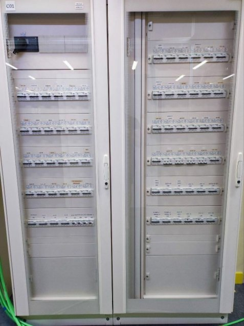

4.6. Programas y servicios
1. Nagios

Nagios es una herramienta de monitoreo de sistemas que tiene la capacidad de supervisar servidores, servicios, aplicaciones que se encuentren en la red. Cuando Nagios detecta un problema, tiene la capacidad de enviar notificaciones a los administradores con detalles del problema.

La manera en la que se muestran los avisos es con una interfaz web intuitiva, altamente personalizable y escalable teniendo la capacidad de integrarse con otros sistemas a través de plugins y APIs.

Como se pueden observar hay diferentes avisos de diferentes sistemas, cada uno con el aviso que notifica Nagios.

2. Prometheus 

Prometheus es un software especializado como sistema de monitorización y alertas escrito en el lenguaje de programación Go. Todos los datos y métricas se almacenan en la base de datos como series temporales (junto al instante de tiempo en el que el valor se ha registrado). También es posible añadir etiquetas de tipo clave-valor junto a estas métricas.

Las métricas que almacena Prometheus pueden ser de cualquier tipo, y dependen de la naturaleza de la aplicación o del sistema que se quiera monitorizar. Por ejemplo, puede ser el uso de CPU o de memoria, número de conexiones, número de peticiones o cantidad de sesiones activas. Todas las mediciones y métricas recogidas ayudarán a diagnosticar errores o problemas de servicio en los sistemas y aplicaciones que se monitorizan.

Aquí se puede observar que la máquina que tiene el servicio de prometheus está a la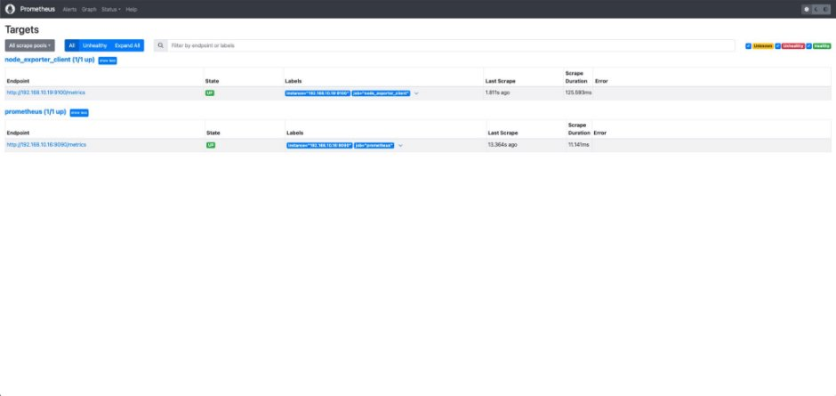 escucha de ella misma y de un cliente que tiene ya la herramienta node-exporter ya instalada

3. Node-exporter 

La opción de node exporter en Prometheus se define como una herramienta a cargo de la obtención de estadísticas de las aplicaciones bajo el formato que estos sistemas implementan, como puede ser el lenguaje de programación eXtensible Markup Language (XML), para luego convertir esas estadísticas en métricas que la plataforma de Prometheus pueda implementar.

Lo que se muestra a continuación es un ejemplo de las métricas que genera la herramienta node-exporter:

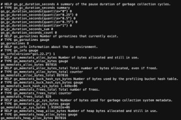

4. Grafana

Grafana es una plataforma de visualización y análisis de datos de código abierto que se ha convertido en una herramienta esencial en entornos de monitoreo y análisis. Con Grafana, los usuarios pueden crear paneles personalizados que muestran datos en tiempo real de forma clara y concisa, lo que facilita la comprensión y la toma de decisiones basadas en datos. Su flexibilidad y capacidad para conectarse a múltiples fuentes de datos lo convierten en una opción popular para visualizar información en entornos de sistemas, redes, aplicaciones y más.

La versatilidad de Grafana radica en su capacidad para integrarse con una variedad de fuentes de datos, como bases de datos, sistemas de monitoreo de sistemas de TI y servicios en la nube, lo que permite a los usuarios consolidar información de múltiples fuentes en un solo lugar. Esto no solo simplifica el proceso de visualización de datos, sino que también brinda a los usuarios la posibilidad de personalizar los paneles según sus necesidades específicas. En resumen, Grafana es una herramienta poderosa que le ayuda a transformar datos en información significativa y visualmente atractiva, ayudándole a tomar decisiones informadas.

A continuación una imagen del panel de métricas de grafana:

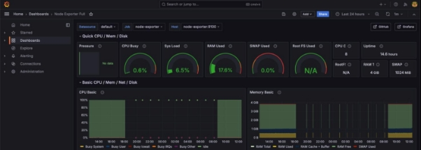

5. Zap-bot

Este bot es un script escrito en bash que ha sido un proyecto dentro de la empresa creado por mi que mediante una imagen de un docker que escanea los dominios que le indicas para detectar y describir las vulnerabilidades que encuentra, está programado para que dentro de este se le pueda indicar, en caso de necesitarlo, los sistemas de autenticación, como pueden ser las contraseñas y usuarios de un entorno de preproducción o incluso de los propios dominios que se encuentran en producción, cara al público, a continuación un ejemplo de ejecución:

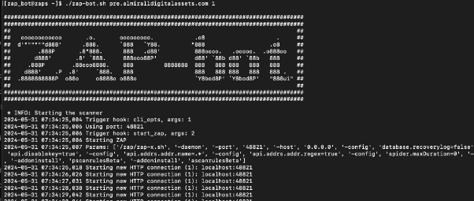
En la imagen se puede ver que se ha indicado una opción la cual no hace falta la contraseña para que el script pueda acceder al entorno para poder realizar el escaneo

Y una vez realizado el escaneo, con una api envía el reporte en un archivo html hacia el sistema de tickets para que el programador que haya pedido el zap pueda descargarlo:

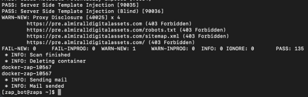

6. Netbox

Netbox es una aplicación que se utiliza para hacer una gestión de la infraestructura de todos los equipos que están configurados dentro de esta.

Dentro de esta aplicación existe la posibilidad de hacer un inventario del hardware, una administración de las interfaces de red y las conexiones físicas entre equipos.

También ofrece la capacidad de poder crear un mapa con la distribución física de los rack, así gestionando de manera exacta cada dispositivo y espacio disponible

Aquí podemos ver como esta distribuido en netbox un rack:

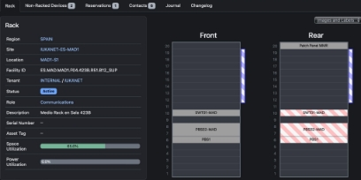

Se puede observar el espacio ocupado por cada equipo dentro del armario, así como el tamaño en U de este.

7. Otros 

4.7.1. Conectividad

En cuanto a la conectividad que se usará para conectar los servidores entre sí como puede ser de corriente como de información son los siguientes:

**Alimentación**

Los cables que se utilizaran son cables de alimentación c13 de 0.5 metros especialmente diseñados para un CPD:

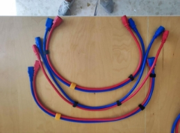

Como se puede observar en la imagen los cables en el extremo macho tienen una forma y color especial para conectar a cada una de las PDU’s que se encuentran en los armarios.

Estos cables son los encargados de suministrar la energía a todos los equipos del armario.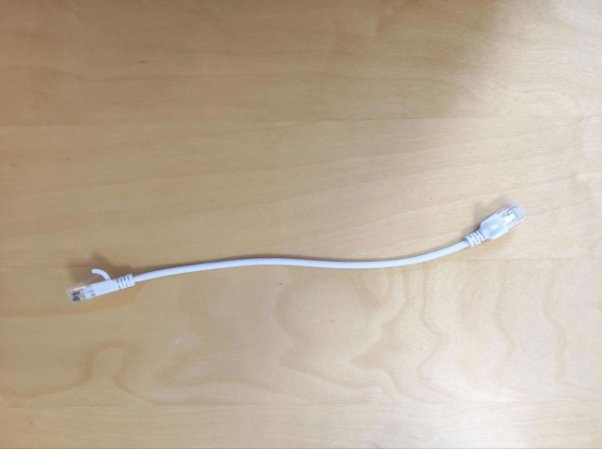

**Internet**

Los cables encargados de intercambiar datos entre equipos y enviarlos a la red, son los cables de internet, que varían por color y tamaño, pudiendo medir desde 0.25 metros para conectar equipos que se encuentren uno cerca con en el otro hasta de varios metros.

A continuación se puede observar un cable de 0.25 metros:

También dependiendo de un color u otro pertenecen a una red u otra, todo para un mayor entendimiento visual, como tanto a la hora de documentar y montar toda la red sea más sencillo.

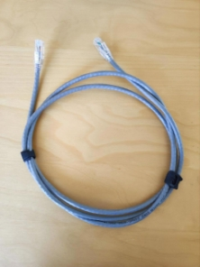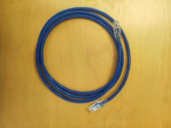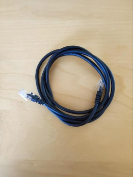

5. **Metodología y Planificación del proyecto**

El proyecto consta de 8 pasos, cada uno de los cuales se explicará brevemente a continuación. En cada punto, en caso de ser necesario, se indicará el tiempo invertido en los diferentes apartados así como los recursos utilizados en cada una de las fases del proyecto.

1. Planificación de la migración

La planificación para la migración de los servidores es una parte crucial de este proceso ya que primeramente se necesita tener claro todos los puntos que se van a trabajar para no realizar un paso en falso o un procedimiento inadecuado que pueda llegar a suponer un problema o entorpecer el resto de la migración.

La duración de este paso será de un día, ya que se reunirá al equipo para explicar el procedimiento de cada uno de los pasos y se explicó cómo se iba a realizar.

2. **Documentación de los racks**

En este punto se explicará cómo se documentarán los equipos con sus respectivos números de serie, nombres dados, y U’s donde estén colocados en el armario para poder identificarlos y que se tenga un control sobre ellos

Esta tarea tendrá un tiempo aproximado de desarrollo de una semana, puesto que se ha tenido que planificar los viajes al CPD, y organizar al personal que se ha tenido que transportar hasta el edificio.

3. **Acuerdo con los clientes para realizar la migración**

En esta parte del proyecto, la empresa se pondrá en contacto con los clientes para notificar de las posibles suspensiones temporales de los servicios y acordar una hora o momento concreto en el cual le suponga el mínimo coste o perjudique en la menor medida de lo posible.

Esta tarea tiene una previsión de alargarse durante varias semanas ya que algunos de los clientes con los que se requiere una reunión para notificar el cambio, puede que no dispongan de la disponibilidad de reunirse durante el tiempo que se les solicita.

4. **Preparación**

Esta fase del proyecto se explicará cómo se lleva a cabo toda la preparación de; nuevos equipos que se utilizaran, los materiales que se usarán así como pueden ser conexiones de red o eléctricas, armarios de comunicaciones donde se colocarán los equipos o la metodología que se usará para llevar a cabo el proyecto.

5. **Migración**

Esta fase del proyecto consta de todo el trabajo que se hará tanto a nivel físico como software, es decir, instalar al nuevo armario o rack los servidores, switches, routers, etc. así como todos los servicios y aplicaciones que se necesiten exportar de unos equipos a otros, así desarrollando la actividad de la migración.

Para esta fase del proyecto se requerirá del menor tiempo posible ya que supone una suspensión temporal de los servicios dados a los clientes que pueda suponer una bajada de rendimiento en sus negocios.

6. Reparación de los daños 

Cuando se acabe la migración siempre ocurre que durante el proceso o una vez finalizada la acción ha habido una anomalía que se ha tenido que resolver, en este apartado del siguiente punto se desarrollarán los métodos por los cuales se resuelven todos los problemas que han ido pasando a lo largo del proceso.

7. Monitorización Evaluación

Cuando todas las anomalías se hayan erradicado y todo esté funcionando de manera operativa se realiza una monitorización de todos los equipos para tener todo bajo control. Para ello se explicará el cómo se monitorizan los equipos para que en caso de que haya un comportamiento anómalo en un servidor, se notifique.

8. Finalización de la migración

Cuando todos los pasos anteriores se hayan realizado, se hará una evaluación de los puntos anteriores para verificar que todo se ha realizado de forma correcta y confirme que se pueda volver a trabajar con normalidad con la migración realizada.

6. **Desarrollo del proyecto**

En este apartado del proyecto se explicará el desarrollo de los puntos explicados anteriormente indicando paso a paso cómo se va a realizar la migración.

1. Planificación de la migración

El primer día de la planificación de la migración, Sergio, el director de operaciones de Iukanet, reunió a los administradores de sistemas que aparecen más abajo para organizar como se realizaría la migración de los servidores. La tarea se repartió de la siguiente manera:

Víctor:

- Colaborar con Sergio y Juan en la transferencia de los servidores.
- Colaborar en la organización de la mudanza y garantizar el correcto manejo de todos los equipos durante el procedimiento.

Sergio:

- Registrar los estantes y la movilidad de personas.
- Garantizar que se registre cada etapa del proceso, incluyendo la identificación y condición de cada equipo antes y después de la migración.

Juan: 

- Interactuar con los clientes.
- Comunicar a los clientes acerca de los pormenores de la migración, abarcando posibles interrupciones del servicio y las acciones implementadas para reducir el impacto.
- Tomar parte de forma activa en la migración junto a Víctor y Sergio.

El haber detallado el plan fue fundamental para organizar la labor del equipo y garantizar que todos los aspectos de la migración estuvieran considerados, reduciendo riesgos y facilitando la migración de los sistemas implicados.

2. Documentación de los racks

Junto con Juan y Sergio, se realizó una visita al Centro de Procesamiento de Datos (CPD) para llevar a cabo un inventario detallado de todos los equipos que se encontraban en los antiguos armarios. Este inventario tuvo como objetivo conocer con precisión el hardware disponible y planificar su reorganización en el nuevo entorno.

Durante la visita, se elaboró una hoja de cálculo en Excel para registrar los números de serie, modelos, marcas, características técnicas y configuraciones de red de cada dispositivo. Este registro detallado permitiría mantener un control de todos los equipos y facilitar su gestión tanto durante como después de la migración.

Cada servidor, switch, router y demás equipos fueron identificados y catalogados con precisión. También se recopiló la información del estado del equipo para decidir qué se hará con el equipo en cuestión a la hora de la migración

Aquí se puede observar un excel que se hizo con la documentación del armario:

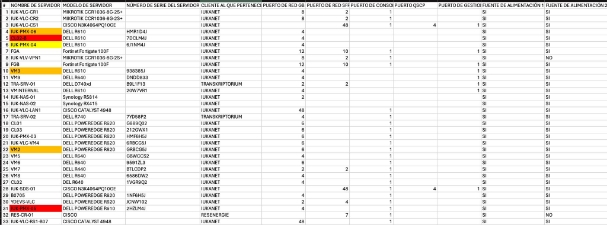

3. Acuerdo con los clientes para realizar la migración

Juan y Sergio dedicaron los siguientes días a coordinar reuniones con los clientes que se verían afectados por la migración. Se aseguraron de comunicar el plan y su calendario de forma clara, abordando cualquier duda o pregunta que pudieran tener los clientes.

Durante estas reuniones, Juan y Sergio pudieron concretar los detalles del proceso de migración con los clientes, incluidas las fechas y horas específicas en las que se suspenderían sus servicios.

4. Preparación

Junto con Juan y Sergio se organizó un día específico para ir al CPD y mover todos los servidores. Además de coordinar esta visita, se aseguró de preparar todo el material necesario para llevar a cabo la operación de manera eficiente. Esto incluía cables de diferentes tipos y longitudes, etiquetas para identificar claramente cada servidor y componente, y diversas herramientas que pudieran ser necesarias para el desmontaje y montaje de los equipos.

La preparación meticulosa fue clave para garantizar que el traslado y la instalación de los servidores se realizaran sin contratiempos.

5. Migración

La realización de la migración se hizo de la siguiente manera:

Primero, se puso en funcionamiento un servidor vacío, destinado a almacenar las máquinas virtuales (VM) que se fueran migrando. Este proceso se realizó de manera gradual, trasladando las VM una a una hasta llenar completamente el servidor ubicado en el nuevo rack. Este enfoque permitió gestionar de manera efectiva la carga de trabajo y minimizar las interrupciones en el servicio.

El procedimiento para migrar las máquinas virtuales se realizó mediante clonación. Se procedió a copiar toda la información contenida en los discos que almacenaban los datos, asegurando que toda la información se duplicara sin fallo alguno. Una vez completada la copia, los datos se transferían al nuevo servidor, donde se verificaron su integridad antes de proceder con la siguiente migración.

Una vez vaciada la información de los discos de un servidor del antiguo rack, el servidor se trasladaba a la nueva sala donde se encontraba el nuevo rack. En esta ubicación, se repetía el procedimiento de clonación y transferencia de datos. Este proceso se mantuvo hasta que todos los servidores hubieran sido migrados al nuevo armario.

Se tuvo especial cuidado de no dañar ninguno de los discos durante la migración, aunque fue inevitable que algunos sufrieran daños, junto con otros problemas que surgieron durante el proceso.

Además, se planificó cuidadosamente cada etapa para minimizar el tiempo de inactividad y asegurar una transición lo más fluida posible. Los equipos técnicos estuvieron presentes en todo momento para supervisar el proceso y resolver cualquier incidencia de manera inmediata.

A continuación se muestra una imagen donde Sergio está preparando una U del armario para colocar un equipo Fortinet 100F:
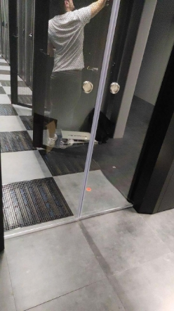
Se puede observar que está dentro de la sala fría donde la temperatura es considerablemente más baja para que el aire que entre dentro de los equipos pueda enfriar los componentes.

6. Reparación de los daños

Los daños que hubo al realizar la migración y se tuvieron que solucionar fueron los siguientes:

1. Discos dañados

Algunos discos duros resultaron dañados durante el proceso de migración. A pesar de las medidas de precaución, fue inevitable que algunos discos sufrieran fallos. Estos daños requirieron la restauración de los datos desde las copias de seguridad y la sustitución de los discos afectados para asegurar la continuidad del servicio.

2. Problemas de red

Hubo incidencias relacionadas con la conectividad de red. Estos problemas incluyeron interrupciones en la conexión y configuraciones incorrectas, lo que afectó la transferencia de datos entre servidores. Estos problemas fueron solucionados mediante la revisión y ajuste de la configuración de red, así como la verificación de la integridad de los cables y equipos de red.

3. Daños físicos 

Durante el traslado de los servidores, específicamente el servidor VM9, sufrió un golpe en una esquina que dificultó la correcta colocación en el nuevo armario, no obstante no sufrió mayores daños que dificultaron su correcto funcionamiento. A pesar de las precauciones tomadas para asegurar el transporte seguro de los servidores.

7. Monitorización Evaluación

Tras finalizar la migración de todas las máquinas, se estableció un sistema de monitorización para supervisar el correcto funcionamiento de los equipos en el nuevo armario. Este sistema permite que podamos recibir alertas en caso de que un servicio o servidor esté fallando o funcionando de manera anómala en tiempo real.

8. Finalización de la migración

Una vez finalizada la migración, Juan y Sergio se encargaron de comunicarse con los clientes para hacerles saber que el proyecto había sido un éxito. Durante las reuniones que se tuvieron con los clientes, se les informó que todos los servicios habían vuelto a la normalidad y que sus servicios volvían a estar operativos con normalidad. Además, se proporcionó apoyo si había alguna pregunta o problema relacionado con la reanudación del trabajo. Este último paso fue importante para asegurarse de que el cliente entiende y está satisfecho con los resultados de la migración y para garantizar una transición donde no hubiese ningún tipo de inconveniente.

7. **Evaluación y conclusiones finales**

La conclusión final a la que se ha llegado al documentar, crear y ejecutar cada paso de esta migración es que se trata de un trabajo muy complejo debido a todos los aspectos que se deben considerar, incluyendo la gestión de clientes, la organización y la planificación. Sin embargo, es un proceso muy entretenido, ya que al documentar se tiene la oportunidad de detallar cada aspecto minuciosamente y, al mover los equipos de un armario a otro, se vuelve muy interesante. Además, esta experiencia permite aprender en diversos campos, tanto en el software de un servidor como en su hardware y su distribución.

8. **Referencias** 

A continuación una lista de las url que han sido de ayuda a la hora de elaborar este proyecto

Iukanet: <https://www.iukanet.com/es/sobre-nosotros>

CPD: <https://es.linkedin.com/company/nixval>

Prometheus:

- <https://prometheus.io/docs/introduction/overview/>
- <https://www.aplyca.com/blog/grafana-y-prometheus-para-monitoreo-de-contenedores>

Node-exporter:

- <https://prometheus.io/docs/guides/node-exporter/>
- [https://keepcoding.io/blog/que-es-node-exporter-en-prometheus/#:~:text=La%20opci %C3%B3n%20de%20node%20exporter%20en%20Prometheus%20se%20define%2 0como,estad%C3%ADsticas%20en%20m%C3%A9tricas%20que%20la](https://keepcoding.io/blog/que-es-node-exporter-en-prometheus/#:~:text=La%20opci%C3%B3n%20de%20node%20exporter%20en%20Prometheus%20se%20define%20como,estad%C3%ADsticas%20en%20m%C3%A9tricas%20que%20la)

Grafana: <https://grafana.com/docs/grafana/latest/setup-grafana/configure-grafana/>

Nagios: <https://www.nagios.org/documentation/>

Zap-bot: <https://www.zaproxy.org/docs/>

[ref1]: Aspose.Words.ccb0f741-94a0-4b07-b589-48d14b36d9e4.002.png
